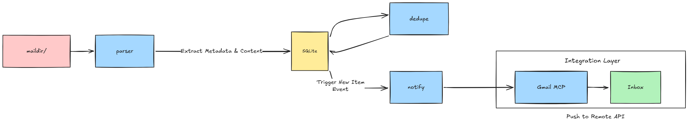
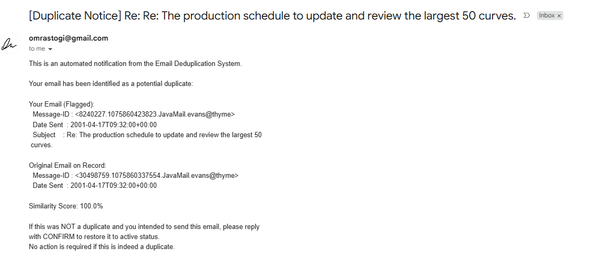
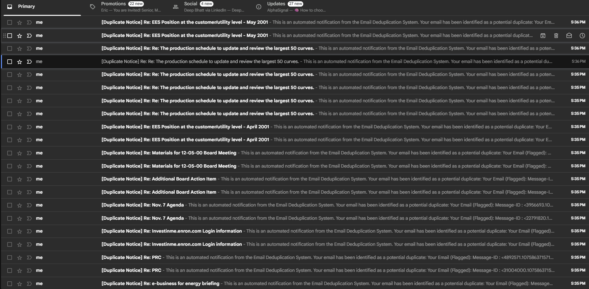

# Enron Email Pipeline

AI-assisted data extraction, storage, duplicate detection, and notification pipeline over the Enron Email Dataset. Built with Claude Code.

## Goal

Parse raw RFC 2822 email files → store in normalized SQLite DB → detect near-duplicate emails via fuzzy matching → send automated notification emails via Gmail MCP server.

## Dataset

**Source:** Enron Email Dataset (`enron_mail_20150507.tar.gz`)  
**Location:** `data/maildir/`  
**Total available:** 21 mailboxes, ~46 600 emails

### Selected Mailboxes

| Mailbox | Emails | Reason |
|---|---|---|
| `guzman-m` | 6 054 | Largest mailbox; broad coverage |
| `lay-k` | 5 937 | CEO mailbox; high-value correspondence |
| `hain-m` | 3 820 | Mid-size; good variety of folder types |
| `blair-l` | 3 415 | Strong thread/reply chain coverage |
| `neal-s` | 3 268 | Rounds dataset to 22 k+ emails |

Total processed: **~22 494 emails** (exceeds 10 000 minimum).

## Architecture

```
src/
├── parser/     # Parse raw email files → Python dicts
├── db/         # Schema creation + SQLite ingestion
├── dedupe/     # Fuzzy duplicate detection + flagging
└── notify/     # Gmail MCP integration + notification sender

data/
└── maildir/    # Raw email files (RFC 2822)

output/
├── replies/    # Draft .eml files (dry-run)
└── send_log.csv

logs/
└── error_log.txt

notes/
└── session_log.md

schema.sql          # DB schema definition
sample_queries.sql  # 3+ example queries
mcp_config.json.example
requirements.txt
AI_USAGE.md
```

## Pipeline Flow

```
maildir/ ──▶ parser/ ──▶ db/ ──▶ dedupe/ ──▶ notify/
             extract      ingest   flag        send email
             fields        SQLite  duplicates  via MCP
```



1. **Parse** — recursively traverse `data/maildir/`, extract mandatory + optional fields, log failures to `logs/error_log.txt`
2. **Ingest** — store in SQLite with normalized tables; unique constraint on `message_id`
3. **Dedupe** — scan DB, group by `from_address` + normalized subject + body similarity ≥ 90%; flag `is_duplicate=true`, set `duplicate_of`; write `duplicates_report.csv`
4. **Notify** — for each flagged duplicate, send notification to original sender via Gmail MCP; log to `output/send_log.csv`

### Notification Email (sample)



### Inbox After Pipeline Run



## Quick Start

```bash
# Install dependencies
pip install -r requirements.txt

# Run full pipeline (dry-run, no emails sent)
python main.py

# Run with live email sending
python main.py --send-live
```

## Requirements

- Python 3.10+
- SQLite (stdlib)
- Gmail MCP server configured (see `mcp_config.json.example`)
- Claude Code with MCP integration (for `notify/` step)

## Key Output Files

| File | Description |
|---|---|
| `duplicates_report.csv` | All duplicate groups with similarity scores |
| `output/send_log.csv` | Live-send log (timestamp, recipient, status) |
| `output/replies/` | Draft `.eml` files for all flagged duplicates |
| `logs/error_log.txt` | Parse failures with file paths and reasons |

## MCP Setup

The pipeline spawns `gmail_mcp_server.py` as a subprocess directly — no Claude Code MCP config needed. The only setup required is `.env`.

### 1. Generate a Gmail App Password

1. Go to [myaccount.google.com/security](https://myaccount.google.com/security) and enable **2-Step Verification** if not already on.
2. Go to [myaccount.google.com/apppasswords](https://myaccount.google.com/apppasswords).
3. Under "Select app" choose **Mail**; under "Select device" choose **Other** and type a name (e.g. `enron-pipeline`).
4. Click **Generate** — copy the 16-character password (shown once).

### 2. Create `.env`

```bash
cp env.example .env
```

Edit `.env`:

```
GMAIL_ADDRESS=you@gmail.com
GMAIL_APP_PASSWORD=abcd efgh ijkl mnop
```

> `.env` is in `.gitignore` and will not be committed.

`mcp_config.json.example` is included for anyone who wants to register the Gmail server with Claude Code interactively, but it is not required to run the pipeline.
